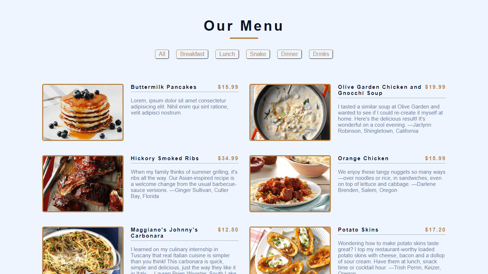
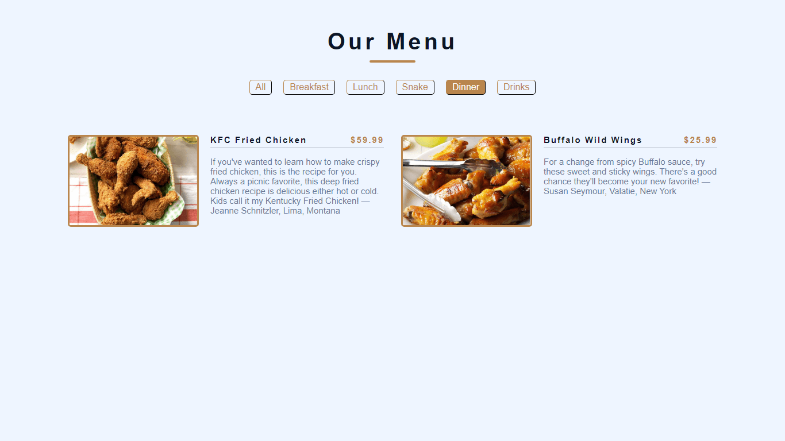
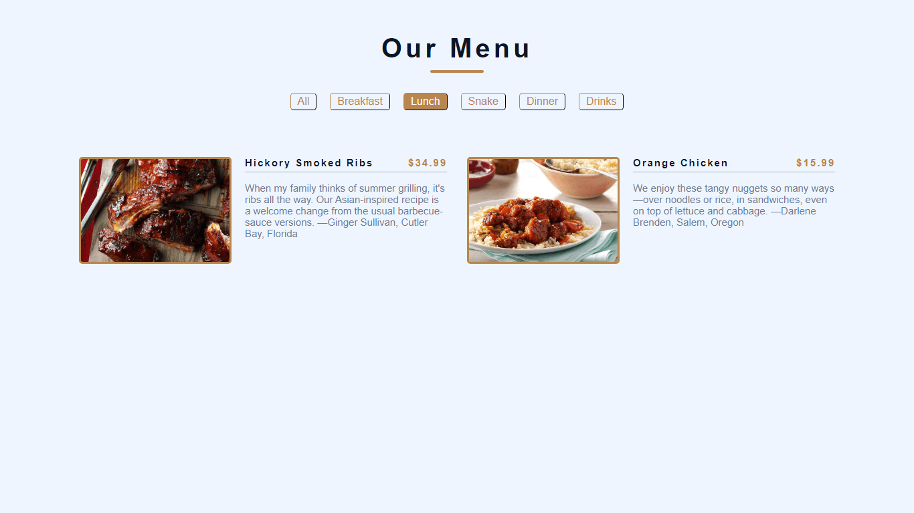

# Restaurent Menu Page 

Making a restaurant menu page that filters through the different food menus. This is a fun project that will teach you higher order functions like map, reduce, and filter.

#### Key concepts covered:
* arrays
* objects
* innerHTML
* for()
* addEventListener()
* this

 

### Screenshots
> 
> 
> 